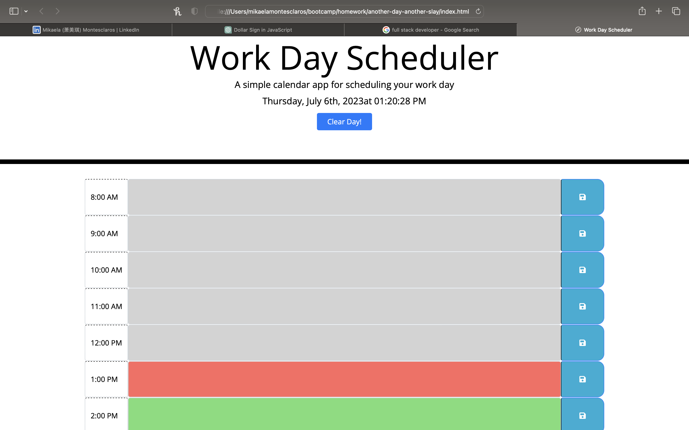

# another-day-another-slay


# MODULE 5 CHALLENGE
<strong> USER STORY: </strong>

* AS AN employee with a busy schedule
I WANT to add important events to a daily planner
SO THAT I can manage my time effectively

<strong> ACCEPTANCE CRITERIA </STRONG>    

  ```bash
GIVEN I am using a daily planner to create a schedule
WHEN I open the planner
THEN the current day is displayed at the top of the calendar
WHEN I scroll down
THEN I am presented with time blocks for standard business hours of 9am to 5pm
WHEN I view the time blocks for that day
THEN each time block is color-coded to indicate whether it is in the past, present, or future
WHEN I click into a time block
THEN I can enter an event
WHEN I click the save button for that time block
THEN the text for that event is saved in local storage
WHEN I refresh the page
THEN the saved events persist
  ```

<STRONG> DESCRIPTION </strong>

* Create a simple calendar application that allows a user to save events for each hour of a typical working day (9am–5pm). This app will run in the browser and feature dynamically updated HTML and CSS powered by jQuery.

<STRONG> KEY CHANGES </strong>

* Add a listener for click events on the save button
* Add code to apply the past, present, or future class to each time block
* Add code to display the current date in the header of the page

<STRONG> DEPLOYMENT </strong>



<STRONG> LINK </strong>

[Work Day Scheduler](https://saymiki.github.io/another-day-another-slay/)

<STRONG> REFERENCES </strong>

* Utilized stack overflow
* Partnered with a friend to implement various functions in the script.js file
